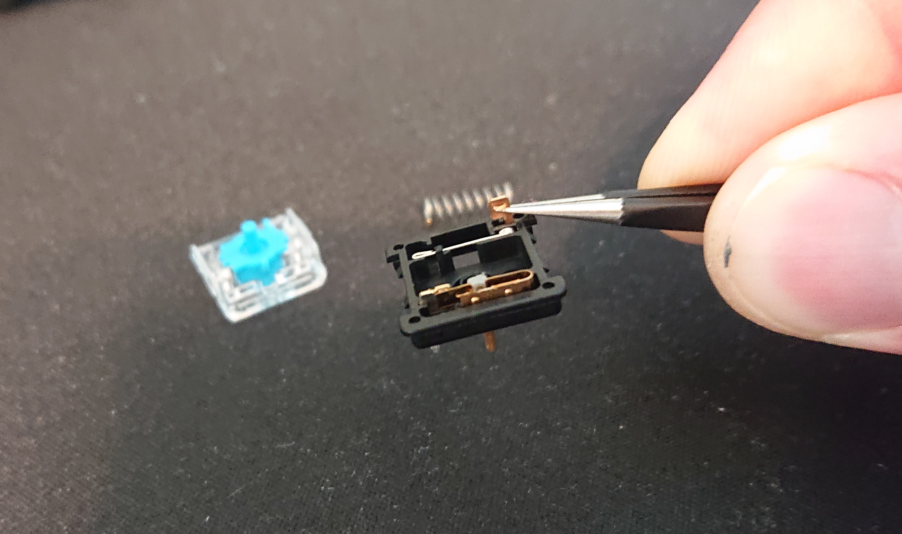
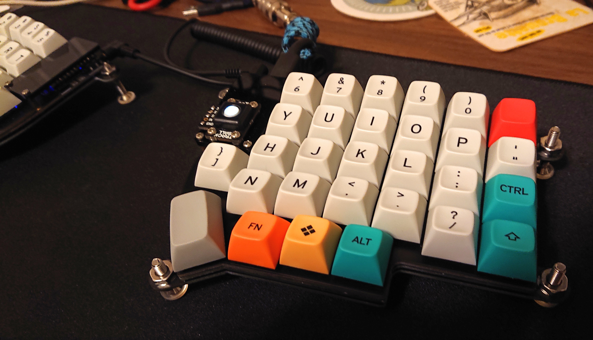

# lily58-mods
Trackball and tilt/tent mods to the Lily58 split ortho keyboard.

# Pimoroni trackball

I've put a [Pimoroni trackball](https://shop.pimoroni.com/products/trackball-breakout) on my Lily58, building on the work of 
[greyhatmiddleman](https://github.com/greyhatmiddleman/crkbd-pimoroni-trackball) and [foureight84](https://github.com/foureight84/sofle-keyboard-pimoroni). You should go read those two projects' documentation before trying to use what I have here to build your own Lily58 with a trackball; my docs don't go into detail on the general background or how to flash the two halves separately currently, though I may fix that at some point.

The hardware follows greyhatmiddleman's approach of using a [SparkFun Pro USB-C Pro Micro with Qwiic connector](https://www.sparkfun.com/products/15795)
to provide the I2C connection for the Pimoroni and mounting the trackball module on the right-hand pro micro cover. Before assembly, I also drilled out all 
the center holes in the switch mounting footprints on the keyboard PCB to 5mm so that a 
[ChocV2](https://www.kailhswitch.com/mechanical-keyboard-switches/key-switches/kailh-low-profile-switch-choc-v2.html) switch will fit (see below).

Using the examples in `transport.c` in both 
projects, I updated the code to work with the most recent QMK `HEAD` (as of June 2021; I intend to keep it up to date, but we'll see how it goes). 
I've also moved a lot of configuration parameters for things like acceleration
and scrolling in `pimoroni_trackball.c` to defines in `config.h` to make it easier to tweak trackball behavior, which is something I found critically
important to getting it usable on a daily basis. My QMK fork with all this stuff is 
[here](https://github.com/dtwright/qmk_firmware/tree/dtwright-lily58-pimoroni/keyboards/lily58/keymaps) in the directories `dtwright-trackball-right` 
(this is the master and side with the trackball) and `dtwright-trackball-left`. 
Like greyhatmiddleman's crkbd work, you have to flash separate images to the right and left sides; at some point I may work on getting this down to one
image with the side set using `EE_HANDS`.

I also think it would not be *terribly* difficult to generalize this code and make it so that you could add a Pimoroni to any split keyboard with a few
defines in `rules.mk` and `config.h`; if I have some time in the near future I might work on that...

# Tilt/tent

I wasn't thrilled with other tilt/tent things I tried for the Lily58 and I wanted an excuse to learn a little bit about [KiCAD](https://kicad.org), so I 
added some round wings for bolts that coule serve as adjustable legs to the base FR4 plate design, and had it 5 copies of the board fabricated by 
[JLCPCB](https://jlcpcb.com). I'm really happy with the result - it's easy to adjust and it looks much cleaner than any improvised tilt/tent stuff I've 
messed with, and the new base plates were really cheap (seriously, check out JLCPCB's prices). Files are [here](https://github.com/dtwright/Lily58/tree/master/Pro/Case).

# Choc V2 modifications
I really like the short travel and low-profile of Kailh Choc swiches, but the available keycaps are a little limiting. The Choc V2 switches seem
like a great solution to that, since they'll take any MX keycap while retaining the same basic mechanics as the original Choc. Unfortunately, in 
order to accomodate the MX stem, they don't fit boards designed for Choc V1s. However, after some experimentation, I worked out they they can
be made compatible pretty easily:
1. Drill out the center hole on the PCB to 5mm. This is pretty safe and easy if you have a drill press, probably just about impossible to do reliably
otherwise.
2. Remove the extra pin from the ChocV2. It has no electrical function, and appears to be there only so that non-plate-mounted configurations 
can be soldered at three points for more stability and strength. The pin is easy to remove without cutting if you open the switch up - just push it 
up from the bottom and then grab it with some tweezers:

While I had the switches open, I also replaced the springs with 30g Spirit springs from [gboards](https://www.gboards.ca/). I'm a big fan of light
springs for ergo keyboards and these feel great. I'm using the blue (clicky) ChocV2s and with the fairly hefty `/dev/tty` keycap set I have on here, 
the 30g spring is as light as I can go and still have the switch reliably return past the click detent to the top of its travel 
(25g springs were too light).

The finished product:

I'm very happy with the feel of this switch/keycap configuration so far.
